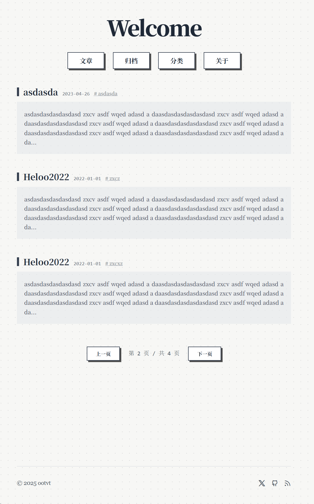

### 找框架
因为想写点东西了，所以有了这样一个博客主题。首先，必须先找一个博客框架，从google搜索最新的静态博客框架，因为自己不会写程序，所以优先找架构比较新的博客程序，反正都是最后都是让ai写嘛。一眼看中了名字以前没有听说过的Astro,好，就你了！

### 本地部署网站
直接问Gemini本地部署Astro的方法：我想用Astro建一个自己的博客，该怎么搞呢？
```bash
// Gemini给我的代码
npm create astro@latest
cd my-blog
npm run dev
```
以前装过npm，这里省略安装步骤。一路next，打开http://localhost:4321 ，成功部署。Gemini建议我安装Tailwind CSS，我也不知道是啥，看名字应该是最新的前端技术，一起安装了，后面应该会用到。

### 博客上线
因为是静态博客，不需要服务器，一般是先用git上传到github，再部署到vercel,netlify之类的网站托管平台,让ai写一个bat批处理一键部署到github。再把仓库链接到vercel。
```bash
git add .
git commit -m "initial commit"
git remote add origin <你的仓库地址>
git push -u origin main
```

### 设计主题
先从网上找几种设计风格供参考，觉得孟菲斯风格比较容易实现，也比较有特点，遂从网上找了一张参考图


然后参照这种风格在figma先设计了一个草稿，自我感觉比较满意：

.png>)

我把图片发给gemini，让它把图片变成代码，还原效果很不错：

