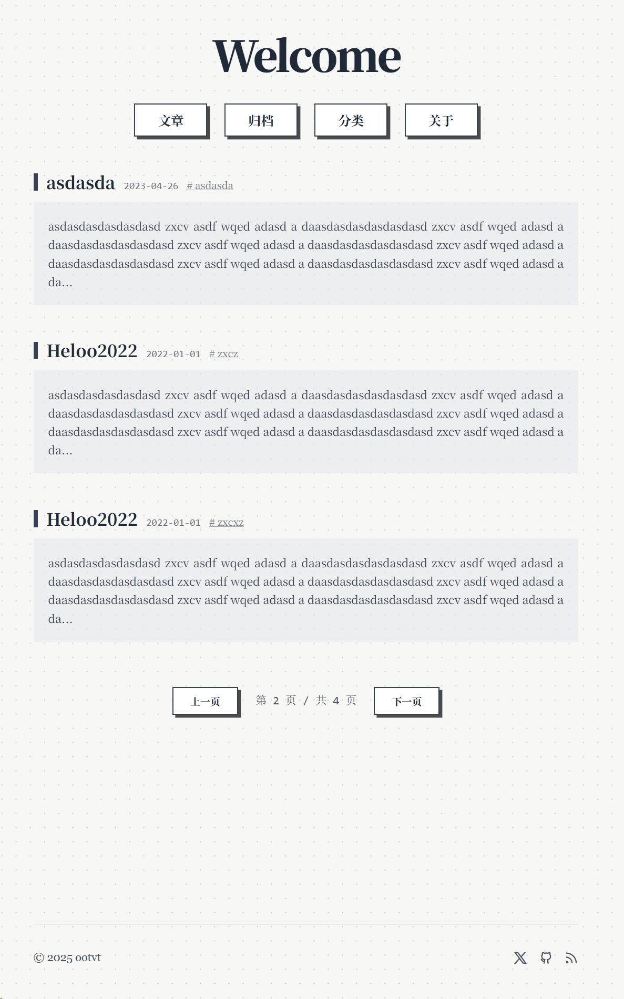
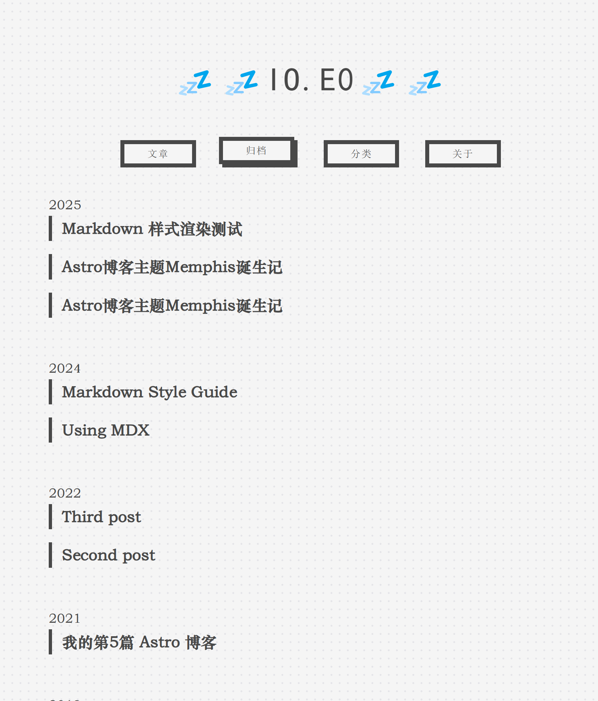
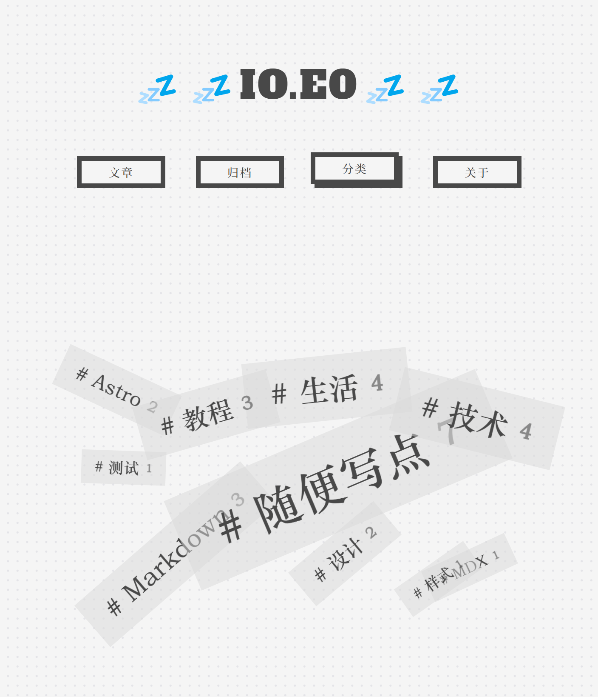

### 找框架
因为想写点东西了，所以有了这样一个博客主题。首先，必须先找一个博客框架，从google搜索最新的静态博客框架，因为自己不会写程序，所以优先找架构比较新的博客程序，反正都是最后都是让ai写嘛。一眼看中了名字以前没有听说过的Astro,好，就你了！

### 本地部署网站
直接问Gemini本地部署Astro的方法：我想用Astro建一个自己的博客，该怎么搞呢？
```bash
// Gemini给我的代码
npm create astro@latest
cd my-blog
npm run dev
```
以前装过npm，这里省略安装步骤。一路next，打开http://localhost:4321 ，成功部署。Gemini建议我安装Tailwind CSS，我也不知道是啥，看名字应该是最新的前端技术，一起安装了，后面应该会用到。

### 博客上线
因为是静态博客，不需要服务器，一般是先用git上传到github，再部署到vercel,netlify之类的网站托管平台,让ai写一个bat批处理一键部署到github。再把仓库链接到vercel。
```bash
git add .
git commit -m "initial commit"
git remote add origin <你的仓库地址>
git push -u origin main
```

### 确定设计风格、博客首页的设计
先从网上找几种设计风格供参考，觉得孟菲斯风格比较容易实现，也比较有特点，遂从网上找了一张参考图，原设计者 @Mr. Milú https://www.awwwards.com/mrmilu/


然后参照这种风格在figma先设计了一个草稿，自我感觉比较满意，在参考对象的基础上融入了自己的设计：首页字体用了比较粗的衬线体，中文也用了衬线体（宋体），笔画比较细，与粗边边框的形状形成强烈对比；文章底框采用半透明矩形，增强层次感，不至于太散乱。

.png>)

我把图片发给gemini，让它把图片变成代码，还原效果很不错：



修改了一下细节，边框粗细、布局、动画、网站名称（就是10点半睡觉的意思），首页就变成现在看到的模样啦，过程省略10000字，都是不停地ai修改试错，过程很繁琐就不记录了。

### 设计归档页面
一开始是想做成这样的效果，但感觉缺少设计感，右边也比较空：



后面就重新用figma设计一个,加了一个底框和首页相呼应，排版上也没有那边空了；年份用一半在底框外面的形式有一种跳脱感，不同年份采用镜像的方式，没有那么呆板；月份用英文缩写，有一点高级感：

.png>)

### 设计TAG页面

原本ai自动帮我生成的分类页面是这样的，一开始我觉得还可以，就是比较普通，也没想好怎么设计：

.png>)

后来想想还是不够有意思，就在网上找tag页的设计参考，大部分都中规中矩；偶然间发现了一种叫tag云的设计，让我有了灵感，就是对应tag的文章数量越多，这个tag就越大，我就想是不是也可以这样设计。但直接像网上那种就又不符合整体网站的设计风格，我就想出了一个方法：保持我原来标签的设计风格，文章越多的tag越大，加上随机分布和角度，有一种随机散落在桌面上的感觉，鼠标悬停时可放大、旋转，增强交互感。我让ai跑了一下，经过数十次的修改，终于有了让我满意的效果：

